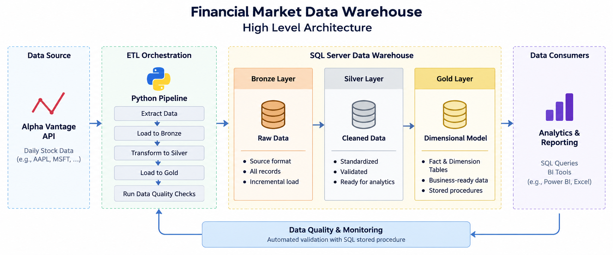
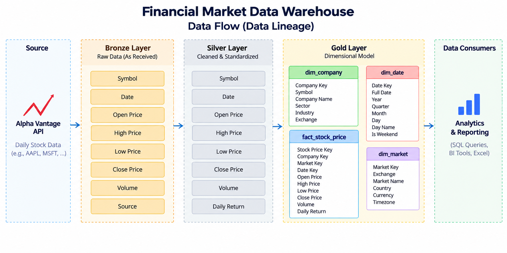
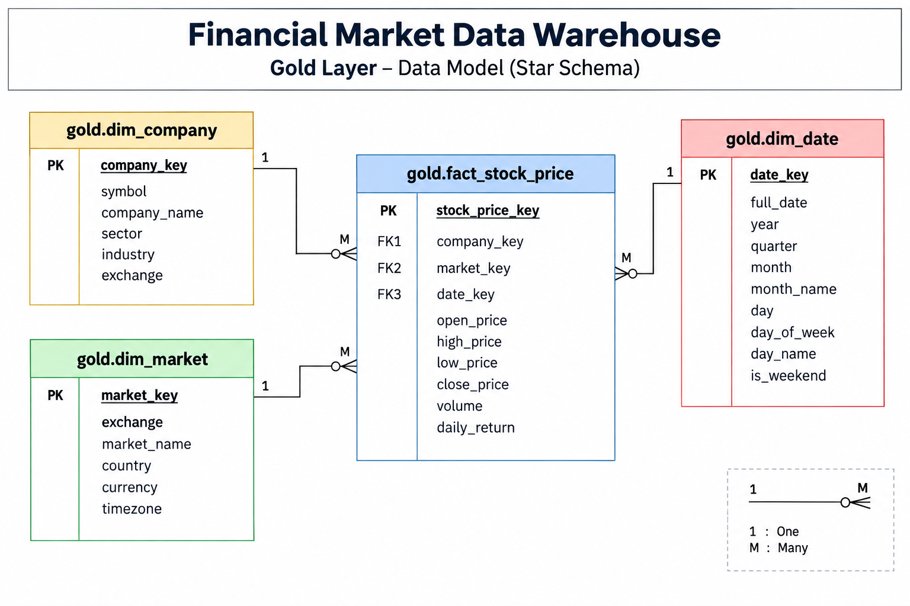

# Financial Market Data Warehouse

An end-to-end **Financial Market Data Warehouse** project built to demonstrate practical data warehousing, ETL/ELT, SQL Server, Python orchestration, dimensional modelling, and data quality validation.

---

## 📌 Project Overview

Financial market data is collected from the **Alpha Vantage API**, processed through a **Bronze → Silver → Gold** warehouse architecture, and exposed through business-ready analytical views.

The pipeline is fully orchestrated using Python and includes automated warehouse data-quality validation.

### Business Objective

Build a centralized and structured warehouse for historical stock-market data that can:

- Ingest market data from an external API
- Preserve raw data in a Bronze layer
- Clean and standardize data in a Silver layer
- Build a dimensional Gold warehouse
- Prevent duplicate records
- Track pipeline executions
- Validate warehouse data quality automatically

---

## 🏗️ Project Architecture



The overall architecture follows:

```text
Alpha Vantage API
        ↓
Python Orchestration
        ↓
Bronze Layer
        ↓
Silver Layer
        ↓
Gold Star Schema
        ↓
Analytical Views
        ↓
Data Quality Validation
```

---

## 🔄 Data Flow



The pipeline processes data through the following stages:

```text
API
 ↓
Extraction
 ↓
Bronze
 ↓
Silver
 ↓
Gold
 ↓
Analytical Views
 ↓
Validation
```

---

## 🧩 Data Model

The Gold layer follows a **Star Schema**.



### Gold Tables

**Fact Table**

- `gold.fact_stock_price`

**Dimension Tables**

- `gold.dim_company`
- `gold.dim_market`
- `gold.dim_date`

### Fact Grain

The fact table stores data at:

> **Company × Market × Trading Date**

### Analytical Views

- `gold.vw_stock_daily_performance`
- `gold.vw_company_performance`
- `gold.vw_market_performance`

---

## ⚙️ Technology Stack

| Technology | Purpose |
|---|---|
| Python | Data extraction & pipeline orchestration |
| Alpha Vantage API | Market data source |
| Microsoft SQL Server | Data warehouse |
| T-SQL | Tables, procedures, transformations & validation |
| Python-dotenv | Environment configuration |
| Git / GitHub | Version control |

---

## 🔁 ETL Pipeline

The complete pipeline is executed through:

```bash
python src/main.py
```

### Pipeline Steps

```text
1. Data Extraction
        ↓
2. Bronze Load
        ↓
3. Silver Transformation
        ↓
4. Gold Layer Load
        ↓
5. Warehouse Data Quality
        ↓
6. Pipeline SUCCESS / FAILURE
```

Each pipeline execution generates a unique `ingestion_id` for traceability.

---

## 🥉 Bronze Layer

The Bronze layer stores the ingested market data and supports incremental loading.

The pipeline reports:

- Records received
- New records inserted
- Existing records skipped
- Ingestion ID

---

## 🥈 Silver Layer

The Silver layer contains cleaned and standardized stock-price data.

The transformation is executed through a SQL Server stored procedure:

```text
silver.usp_load_stock_price
```

---

## 🥇 Gold Layer

The Gold layer provides the business-ready dimensional model.

```text
                  dim_company
                       |
                       |
dim_market ─── fact_stock_price ─── dim_date
```

Gold loading is handled through stored procedures including:

```text
gold.usp_load_dim_company
gold.usp_load_dim_market
gold.usp_load_dim_date
gold.usp_load_fact_stock_price
gold.usp_load_all
```

---

## ✅ Data Quality

Warehouse validation is integrated directly into the Python orchestration.

The pipeline executes:

```text
gold.usp_run_data_quality_checks
```

The validation contains **16 checks** covering:

- Bronze record count
- Silver record count
- Gold fact record count
- Dimension counts
- Duplicate fact records
- NULL foreign keys
- Orphan foreign keys
- Invalid OHLC records
- Invalid volume records
- NULL financial measures

The results are displayed directly in the terminal with:

```text
Actual
Expected
Failed Rows
Status
```

Example:

```text
Total checks : 16
Passed checks: 16
Failed checks: 0

Overall warehouse validation: PASS
```

A failed data-quality validation causes the pipeline to fail rather than silently completing.

---

## 📊 Project Results

The implemented pipeline successfully demonstrates:

- API-based data ingestion
- Layered data warehouse architecture
- Bronze/Silver/Gold processing
- Star-schema dimensional modelling
- Stored-procedure based transformations
- Python-based orchestration
- Incremental/idempotent loading
- Ingestion tracking
- Automated data-quality validation
- Pipeline failure handling

The project is intentionally focused on **data engineering and data warehousing skills** rather than building a Power BI dashboard.

---

## 📁 Repository Structure

```text
financial-market-data-warehouse/
│
├── README.md
├── requirements.txt
├── .gitignore
├── .env.example
│
├── config/
│   └── stocks.json
│
├── data/
│   └── sample/
│       └── AAPL_raw.json
│
├── docs/
│   ├── images/
│   │   ├── project_architecture.png
│   │   ├── data_model.png
│   │   └── data_flow.png
│   │
│   ├── architecture.md
│   ├── data_model.md
│   ├── data_flow.md
│   ├── data_catalog.md
│   ├── naming_conventions.md
│   ├── etl_pipeline.md
│   ├── data_quality.md
│   └── setup.md
│
├── sql/
│   │
│   ├── 01_database/
│   │   └── create_database.sql
│   │
│   ├── 02_schemas/
│   │   └── create_schemas.sql
│   │
│   ├── 03_bronze/
│   │   ├── create_tables.sql
│   │   └── ingestion_log.sql
│   │
│   ├── 04_silver/
│   │   ├── create_tables.sql
│   │   └── load_silver.sql
│   │
│   ├── 05_gold/
│   │   ├── create_dimensions.sql
│   │   ├── create_fact.sql
│   │   ├── load_dimensions.sql
│   │   ├── load_fact.sql
│   │   └── load_all.sql
│   │
│   ├── 06_views/
│   │   └── analytical_views.sql
│   │
│   └── 07_validation/
│       └── data_quality_checks.sql
│
└── src/
    ├── __init__.py
    ├── api_client.py
    ├── bronze_loader.py
    ├── data_parser.py
    ├── database.py
    ├── gold_loader.py
    ├── ingestion.py
    ├── main.py
    ├── silver_loader.py
    ├── test_api.py
    ├── test_database.py
    └── warehouse_validation.py
```

---

## 🚀 Setup & Execution

For complete installation and execution instructions, see:

**[`docs/setup.md`](docs/setup.md)**

Basic execution:

```bash
python src/main.py
```

The pipeline will extract the data, load the warehouse layers, execute Gold loading, and run the final data-quality validation.

---

## 📚 Documentation

| Document | Description |
|---|---|
| [`architecture.md`](docs/architecture.md) | System architecture |
| [`data_model.md`](docs/data_model.md) | Gold star schema and relationships |
| [`data_flow.md`](docs/data_flow.md) | End-to-end data flow |
| [`data_catalog.md`](docs/data_catalog.md) | Tables, columns and business definitions |
| [`naming_conventions.md`](docs/naming_conventions.md) | Database and Python naming standards |
| [`etl_pipeline.md`](docs/etl_pipeline.md) | ETL/orchestration process |
| [`data_quality.md`](docs/data_quality.md) | Warehouse validation framework |
| [`setup.md`](docs/setup.md) | Project setup and execution |

---

## 🔐 Security

API credentials are stored through environment variables.

```text
ALPHA_VANTAGE_API_KEY=your_api_key
```

The `.env` file should never be committed to GitHub.

---

## 🎯 Key Skills Demonstrated

**Data Warehousing**

- Medallion Architecture
- Star Schema
- Fact & Dimension Modelling
- Surrogate Keys
- Primary/Foreign Keys
- Data Warehouse Constraints

**ETL / Data Engineering**

- API ingestion
- Incremental loading
- Data transformation
- Stored procedures
- Python orchestration
- Pipeline logging
- Error handling

**Data Quality**

- Automated validation
- Referential integrity checks
- Duplicate detection
- Financial-data validation
- Pipeline quality gates

**Tools**

`Python` · `SQL Server` · `T-SQL` · `Alpha Vantage API` · `Git` · `GitHub`
